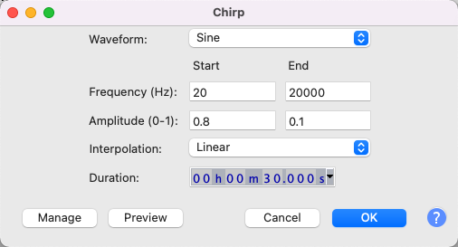
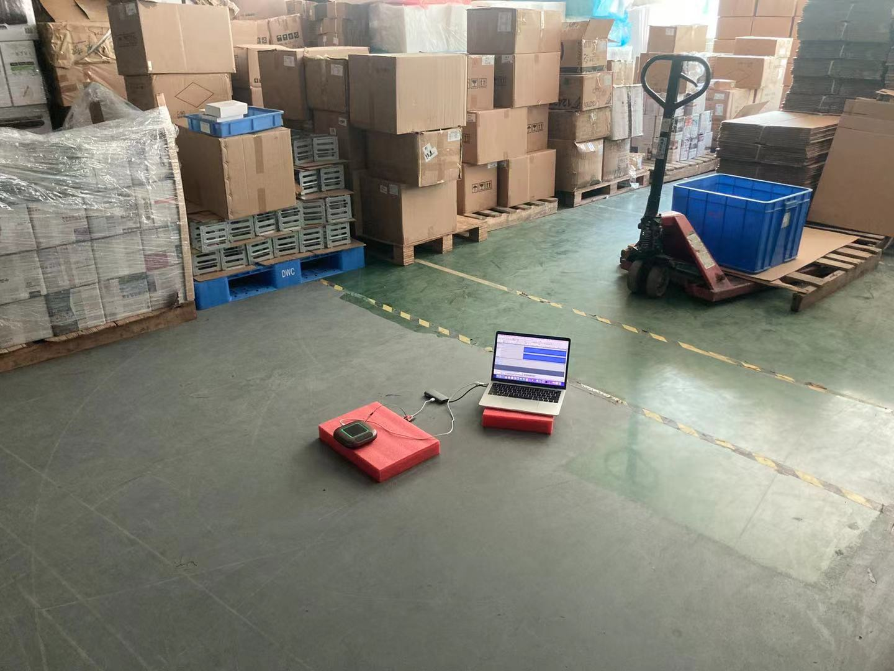
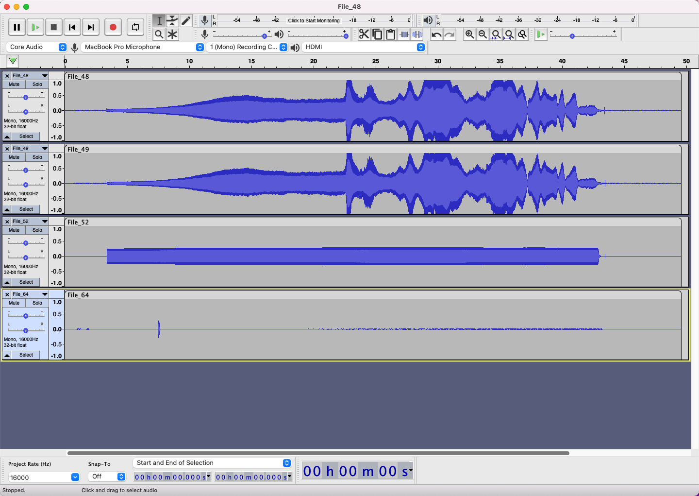
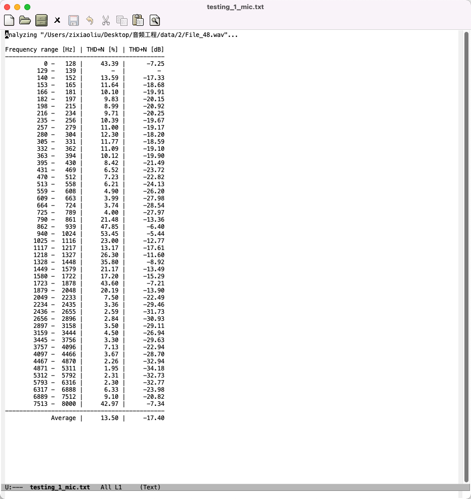
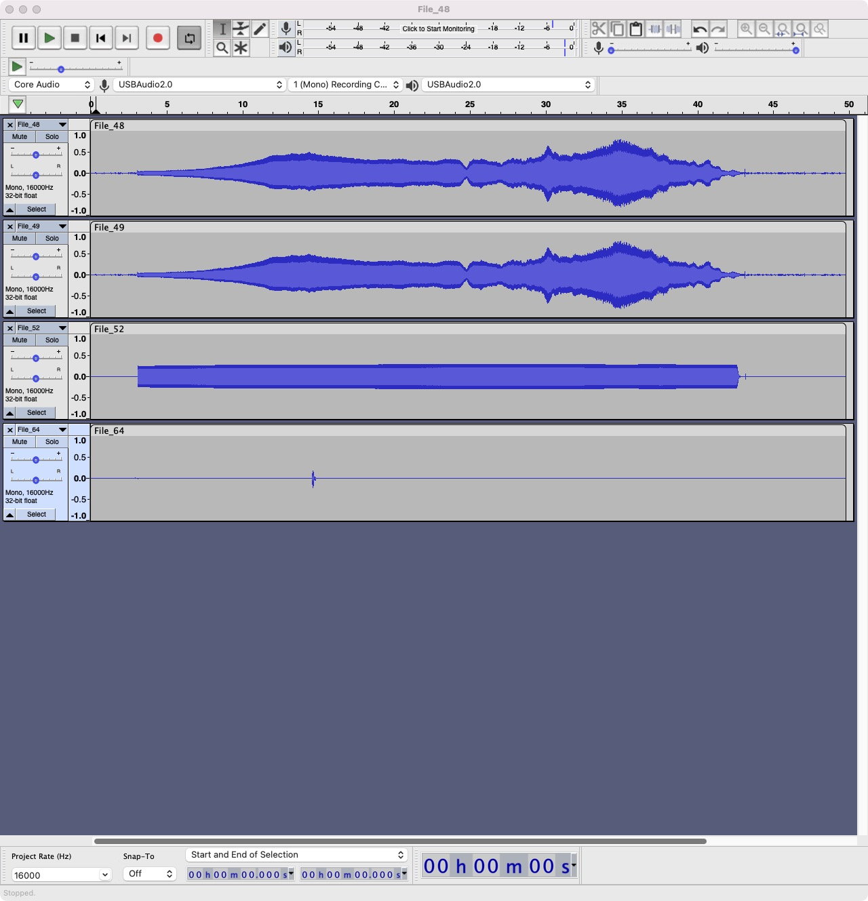
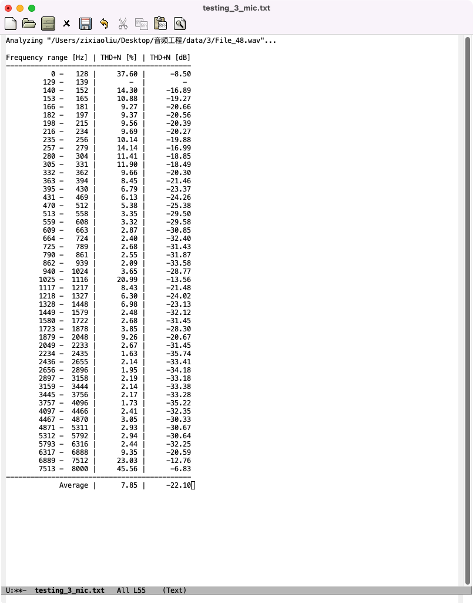

### 568失真测试

##### 第一次测试
* 软件设置
1. Audacity扫频参数

2. largeread设置
打开终端，进入工作路径(largeread需在此路径）后，输入命令使芯片抓取数据 
命令形式: ./largeread port baudrate save_to
本次测试的命令： ./largeread 3 3000000 a.bin

* 测试环境(红色海绵垫用于减少共振)

* 测试流程：
1. 先在audacity中播放扫频音频，同时开启录制（注意扫频音频前应有几秒空内容，否则先播放再抓取会导致前面的频率丢失）
2. 在终端执行抓取命令
3. 等扫频音频播放完后，先command+c终止抓取，再停止audacity. 
    抓取的2进制流.bin文件即为我们所需的log数据

。
。
。
。
。
。

* wav文件失真分析
脚本： thdncalcalator.py
命令形式： python thdncalcalator.py xxxxxx.wav
(xxxxxx.wav应为麦克风的录音文件)
 
* 测试结果
两个麦克风，参考，处理后音频分别为
 
各频段失真为
 
* 结果分析：
第三列(THD+N [%])为失真百分比，低于5%是优秀水平，高于10%效果较差。
从失真表格看出，有许多频段失真比较严重
Audacity可以看出两个麦克风在很多频段都超出测量范围，进而导致了失真
怀疑失真是铝合金外壳共振引入的，去掉外壳进行第二次测试

##### testing2: 
* 测试结果
两个麦克风，参考，处理后音频分别为

各频段失真为

* 结果分析
可以看出去掉铝合金外壳后，失真减少了很多

