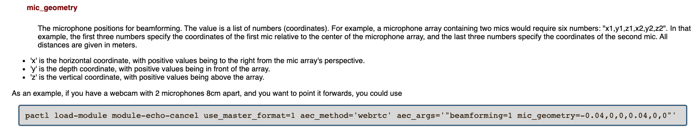
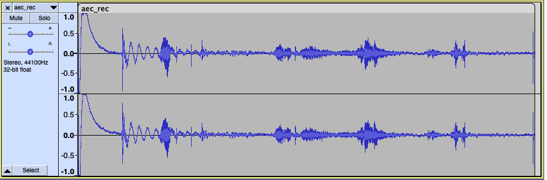
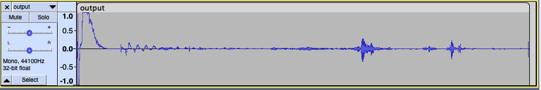
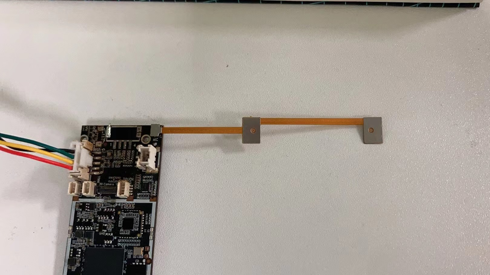
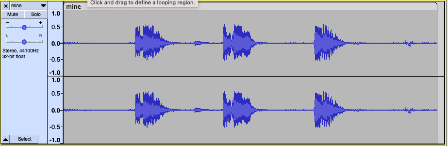
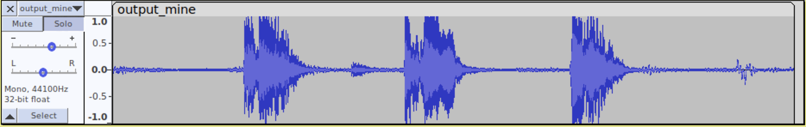
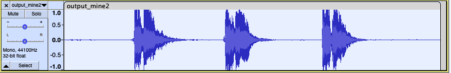

# 复现
        
## **运行webrtc-beamforming**
[<u>git</u>](https://github.com/ctwgL/webrtc-beamforming)链接
> ./webrtc-bf -i input.wav -mic_positions "x1 y1 z1 x2 y2 z2" -o output.wav

麦克风位置
[<u>说明</u>](https://www.freedesktop.org/wiki/Software/PulseAudio/Documentation/User/Modules/?updated#index45h3)
如下(module-echo-cancel)

运行代码 
> ./webrtc-bf -i aec_rec.wav -mic_positions "-0.04 0 0 0.04 0 0" -o output.wav
    
(aec_rec.wav为
[<u>webrtc文章</u>](https://arunraghavan.net/2016/06/beamforming-in-pulseaudio/)的示范录音，
"-0.04 0 0 0.04 0 0"表示一个麦克风在麦克风阵列中心左边0.04米，另一个在麦克风阵列中心右边0.04米，output.wav为beamforming算法处理过后的音频)

原始音频： 

    
处理后音频： 

分析：
    
在麦克风阵列左右两边的声音被消除了，中间的被保留，效果很好。 
这个代码目前只能保留中间的声音，消除两边的声音，还不能改变beamforming的角度. [<u>具体代码说明</u>](https://github.com/pulseaudio/pulseaudio/blob/master/src/modules/echo-cancel/webrtc.cc#L411 )
在这

## **尝试自己录音，再应用beamforming**
运行代码：
> ./webrtc-bf -i mine.wav -mic_positions "-0.02 0 0 0.02 0 0" -o output_mine.wav

两个麦克风相距0.04米，如下图所示

原始音频：分别在左边，中间，右边说话，左右两边的说话位置与中心线夹角约为30度；

    

处理后音频：

分析：
eamforming处理后的音频效果不好，可能是麦克风位置太近，或者左右两边角度还不够大

## **增大角度至70度，再次测试**
运行代码：
> ./webrtc-bf -i mine2.wav -mic_positions "-0.02 0 0 0.02 0 0" -o output_mine2.wav

处理后音频： 

分析：
结果仍然不好

- - - 

